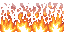
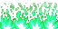
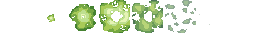
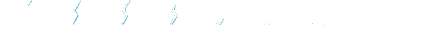

# Tower Game

2D platformer feito em Godot 4, com progressao por andares, combate corpo a corpo e portal de saida.

## Visao Geral

- O jogador sobe andares enfrentando ondas e grupos de inimigos.
- Cada andar e limpo ao derrotar todos os mobs.
- Ao limpar o andar, o portal de saida e ativado.
- Ha sistema de XP e level up via autoload PlayerStats.

## Como Rodar

1. Abra o projeto no Godot 4.
2. Rode a cena principal com F5.
3. Para testar uma cena especifica, use F6.

Nao ha build CLI nem testes automatizados neste repositorio.

## Controles

- A / Seta Esquerda: mover para esquerda
- D / Seta Direita: mover para direita
- W / Espaco / Seta Cima: pular
- Botao esquerdo do mouse: atacar

## Estrutura Principal

- autoload/GameManager.gd: troca de andares, save/load em user://savegame.json
- autoload/PlayerStats.gd: vida, XP e level do jogador
- scenes/main.tscn: cena raiz com jogo e UI
- scenes/world/: andares do jogo
- scenes/enemies/: cenas dos inimigos e bosses
- scripts/enimies/: IA e comportamento dos inimigos

## Bosses

### Mushroom Boss (MiniBoss)

- Cena: scenes/enemies/mini_boss.tscn
- Script: scripts/enimies/mini_boss.gd
- Vida base: 320
- Dano base: 16
- XP ao derrotar: 320
- Especial: Toxic Burst
	- Carrega enquanto acerta ataques normais.
	- Ativa efeito de green fire + poison + smoke.
	- Causa dano extra em sequencia.

### Skeleton Boss

- Cena: scenes/enemies/skeleton_boss.tscn
- Script: scripts/enimies/skeleton_boss.gd
- Vida base: 280
- Dano base: 22
- XP ao derrotar: 380
- Especial: Thunder Smash
	- Em ciclos de ataque, dispara especial com thunder + smoke.
	- Causa dano extra no impacto.

## Efeitos Visuais dos Especiais

## Lore

O mundo da torre foi selado por um antigo ritual. Cada andar guarda ecos de batalhas antigas, e os inimigos sao fragmentos corrompidos dessa magia.

No terceiro andar, o Mushroom Boss representa a corrupcao alquimica da torre, usando fogo verde e veneno para enfraquecer invasores.

No quarto andar, o Skeleton Boss protege os niveis superiores com poder de tempestade, invocando trovões para eliminar qualquer heroi que tente subir.

O jogador avanca andar por andar, reunindo experiencia, aumentando seu poder e abrindo caminho ate o topo da torre.

## Notas da Versao Atual

- IA base com melhor distribuicao de mobs (menos aglomeracao)
- Patrulha curta aleatoria logo apos spawn, interrompida ao detectar o jogador
- Barrinha de vida por inimigo
- Floor 1 reformulada para spawn por wave mais estavel
- Melhorias de movimento e especial nos bosses

## Proximos Passos

- Balancear dano e cooldown dos especiais em runtime
- Ajustar count e delay das waves por dificuldade alvo
- Adicionar checklist de teste manual por andar